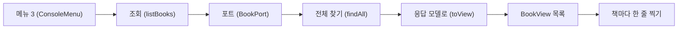

# book-list 흐름

```mermaid
flowchart LR
  A["메뉴 3 (ConsoleMenu)"] --> B["조회 (listBooks)"]
  B --> C["포트 (BookPort)"]
  C --> D["전체 찾기 (findAll)"]
  D --> E["응답 모델로 (toView)"]
  E --> F["BookView 목록"]
  F --> G[책마다 한 줄 찍기]
```
