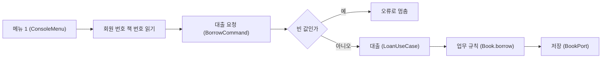

# borrow-command 흐름

```mermaid
flowchart LR
  A["메뉴 1 (ConsoleMenu)"] --> B[회원 번호 책 번호 읽기]
  B --> C["대출 요청 (BorrowCommand)"]
  C --> D{빈 값인가}
  D -->|예| E[오류로 멈춤]
  D -->|아니오| F["대출 (LoanUseCase)"]
  F --> G["업무 규칙 (Book.borrow)"]
  G --> H["저장 (BookPort)"]
```

- 형식 검사는 대출 요청이 만들어질 때 한다
- 업무 규칙 검사(이미 대출 중)는 도메인 책에 남는다
