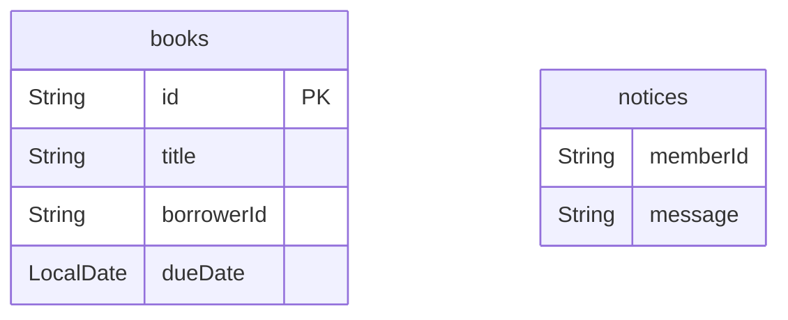

# dependency-check ERD

```mermaid
erDiagram
  books {
    String id PK
    String title
    String borrowerId
    LocalDate dueDate
  }
  notices {
    String memberId
    String message
  }
```

- 저장 파일 data/books.txt의 한 줄이 책 하나다
- 알림 파일 data/notices.txt의 한 줄이 보낸 알림 하나다

이 장에서 생기거나 바뀐 것
- 없다. 저장 파일과 알림 파일은 overdue-notice와 같다
