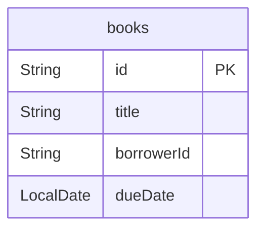

# due-date ERD

```mermaid
erDiagram
  books {
    String id PK
    String title
    String borrowerId
    LocalDate dueDate
  }
```

- 저장 파일 data/books.txt의 한 줄이 책 하나다
- 칸은 쉼표로 나눈 id, title, borrowerId, dueDate 순서다
- 대출 중이 아니면 borrowerId와 dueDate 칸이 비어 있다

이 장에서 생기거나 바뀐 것
- books에 dueDate 칸이 생겼다
