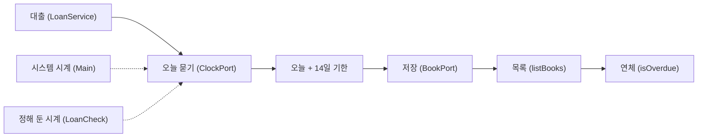

# due-date 흐름

```mermaid
flowchart LR
  A["대출 (LoanService)"] --> B["오늘 묻기 (ClockPort)"]
  B --> C["오늘 + 14일 기한"]
  C --> D["저장 (BookPort)"]
  D --> E["목록 (listBooks)"]
  E --> F["연체 (isOverdue)"]
  S["시스템 시계 (Main)"] -.-> B
  X["정해 둔 시계 (LoanCheck)"] -.-> B
```

- 서비스는 오늘 날짜를 시계 포트에만 묻는다
- Main은 SystemClockAdapter, 두 번째 입구는 FixedClockAdapter를 끼운다
- 목록은 시계가 알려 준 오늘이 기한을 지났는지로 연체를 붙인다
