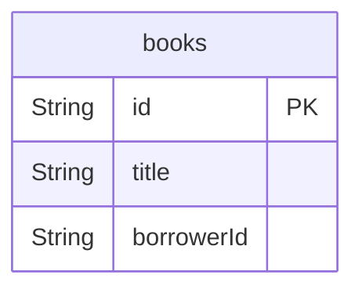

# file-store ERD

```mermaid
erDiagram
  books {
    String id PK
    String title
    String borrowerId
  }
```

- 저장 파일 data/books.txt의 한 줄이 책 하나다
- 칸은 쉼표로 나눈 id, title, borrowerId 순서다

이 장에서 생긴 것
- books 저장 파일
