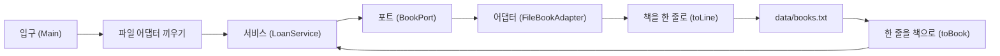

# file-store 흐름

```mermaid
flowchart LR
  A["입구 (Main)"] --> B["파일 어댑터 끼우기"]
  B --> C["서비스 (LoanService)"]
  C --> D["포트 (BookPort)"]
  D --> E["어댑터 (FileBookAdapter)"]
  E --> F["책을 한 줄로 (toLine)"]
  F --> G["data/books.txt"]
  G --> H["한 줄을 책으로 (toBook)"]
  H --> C
```
