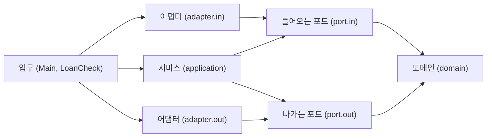

# hexagon-packages 흐름

```mermaid
flowchart LR
  A["입구 (Main, LoanCheck)"] --> B["어댑터 (adapter.in)"]
  A --> C["서비스 (application)"]
  A --> D["어댑터 (adapter.out)"]
  B --> E["들어오는 포트 (port.in)"]
  C --> E
  C --> F["나가는 포트 (port.out)"]
  D --> F
  E --> G["도메인 (domain)"]
  F --> G
```
