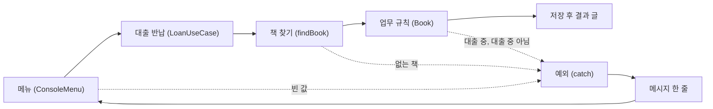

# loan-errors 흐름

```mermaid
flowchart LR
  A["메뉴 (ConsoleMenu)"] --> B["대출 반납 (LoanUseCase)"]
  B --> C["책 찾기 (findBook)"]
  C --> D["업무 규칙 (Book)"]
  D --> E[저장 후 결과 글]
  C -.->|없는 책| F["예외 (catch)"]
  D -.->|대출 중, 대출 중 아님| F
  A -.->|빈 값| F
  F --> G[메시지 한 줄]
  G --> A
```

- 서비스와 도메인은 메시지를 담은 예외를 던지기만 한다
- 콘솔 메뉴의 catch 한 곳이 예외를 메시지 한 줄로 바꾸고 메뉴로 돌아간다
