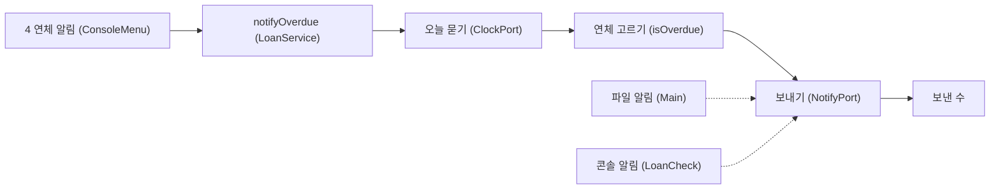

# overdue-notice 흐름

```mermaid
flowchart LR
  A["4 연체 알림 (ConsoleMenu)"] --> B["notifyOverdue (LoanService)"]
  B --> C["오늘 묻기 (ClockPort)"]
  C --> D["연체 고르기 (isOverdue)"]
  D --> E["보내기 (NotifyPort)"]
  E --> F[보낸 수]
  P["파일 알림 (Main)"] -.-> E
  Q["콘솔 알림 (LoanCheck)"] -.-> E
```

- 서비스는 연체된 책마다 알림 포트의 send만 부른다
- Main은 FileNotifyAdapter, 두 번째 입구는 ConsoleNotifyAdapter를 끼운다
- 같은 서비스가 끼운 어댑터에 따라 파일이나 콘솔로 알린다
