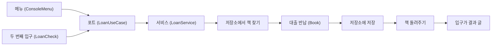

# use-case-port 흐름

```mermaid
flowchart LR
  A["메뉴 (ConsoleMenu)"] --> C["포트 (LoanUseCase)"]
  B["두 번째 입구 (LoanCheck)"] --> C
  C --> D["서비스 (LoanService)"]
  D --> E[저장소에서 책 찾기]
  E --> F["대출 반납 (Book)"]
  F --> G[저장소에 저장]
  G --> H[책 돌려주기]
  H --> I[입구가 결과 글]
```
