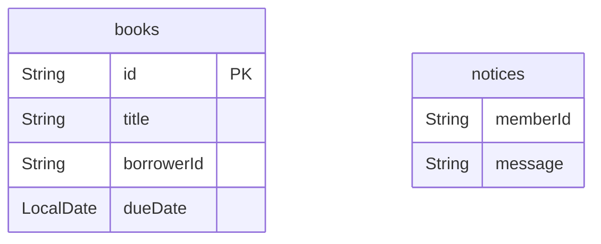

# ERD

기준 장: dependency-check

```mermaid
erDiagram
  books {
    String id PK
    String title
    String borrowerId
    LocalDate dueDate
  }
  notices {
    String memberId
    String message
  }
```

- 저장 파일 hexa/data/books.txt의 한 줄이 책 하나다
- 알림 파일 hexa/data/notices.txt의 한 줄이 보낸 알림 하나다
- 두 번째 입구 LoanCheck는 파일 대신 메모리 저장과 콘솔 알림을 쓴다
